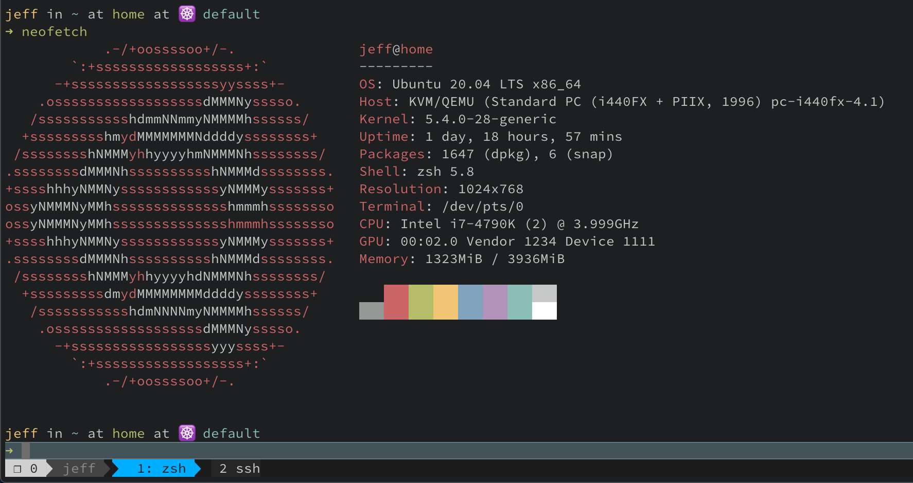

# Dotfiles



## Introduction

@billimek dotfiles implementation leveraging the following:

* [yadm](https://thelocehiliosan.github.io/yadm/) - wrapper around the got sparse repo concept instead of symlinks
* [zgen](https://github.com/tarjoilija/zgen) - lightweight zsh plugin system
* [zsh](http://zsh.sourceforge.net/) - great shell

## Installation

### One-liner

```console
curl -fsSL https://raw.githubusercontent.com/billimek/dotfiles/master/.config/yadm/setup.sh | sh -
```

### Manual installation

Prerequisites:

#### MacOS

Install homebrew:

```shell
/usr/bin/ruby -e "$(curl -fsSL https://raw.githubusercontent.com/Homebrew/install/master/install)"
```

Install yadm

```shell
brew install yadm
```

#### Linux

Install yadm:

```shell
apt-get install -y yadm
```

### Install dotfiles via yadm

```shell
yadm clone https://github.com/billimek/dotfiles.git
```

### Migrating from old yadr dotfiles approach to this repo

Before doing `yadm clone ...`, remove all of the old symlinks from the home directory first.  Take care not to delete any legitimate links!

```shell
find "$HOME" -maxdepth 1 -type l -name ".*" -delete
```

## TODO

* iterm2 stuff (themes, etc) - is this necessary with cloud-based iterm config settings?
* extra vim configuration (plugins)???
* linux fonts?
* macos defaults code settings
* ruby stuff
